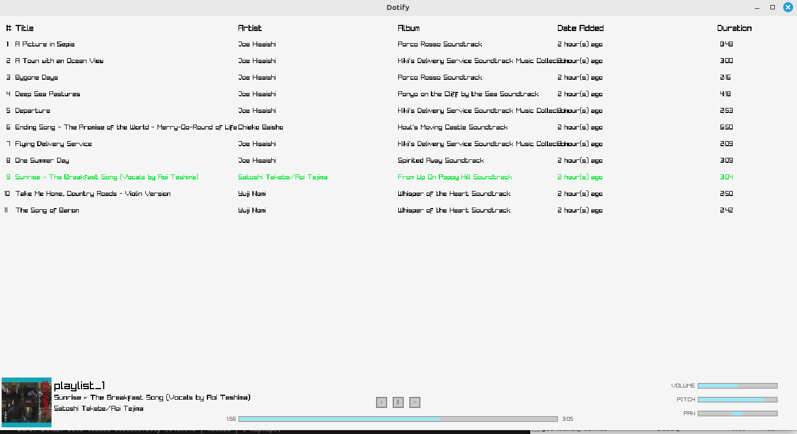

# Dotify Music Player - Setup Guide

## Overview

This is a lightweight music player application that allows you to:

- Play MP3 files organized in playlists (folders)
- Add/delete playlists and songs in real-time
- Listen to playlists in shuffle mode and loop playback for your favorite songs
- Adjust music settings such as volume, pitch, and pan settings

---

## Prerequisites

### Dependencies

Before installing Dotify, ensure you have the following installed on your system:

#### FFmpeg libraries (for audio processing and metadata extraction):

```bash
sudo apt-get install libavformat-dev libavutil-dev
```

#### Raylib (for the graphical interface):

```bash
sudo apt-get install libraylib-dev
```

Or build from source: [Raylib GitHub](https://github.com/raysan5/raylib)

### Directory Structure

Ensure the following directories exist for Dotify to work properly:

```
~/Music/                  # Contains your playlists (each subfolder is a playlist)
```

## Installation

### Clone or download the source code

```bash
git clone https://github.com/yourusername/dotify.git
cd dotify # move to the application directory
```

### Build the application

```bash
make
```

This will compile the application into an executable named `dotify`.

### Clean up (optional)

To remove generated files and the album art cache:

```bash
make clean
```

---

## Usage

### Run the application

```bash
./dotify
```

## Controls

### Playback

- `Space`: Play/Pause
- `A` or `←`: Rewind / Restart song
- `D` or `→`: Skip to next song
- `R`: Restart current song

### Playback Modes

- `S`: Toggle shuffle mode
- `L`: Toggle loop mode

### Navigation

- `P`: Toggle between playlist view and song view

---

## Managing Music

### Adding Music

- Simply create folders in `~/Music` (each folder is a playlist)
- Add `.mp3` files to those folders
- The application detects changes automatically

### Album Art

- Album art is automatically extracted from `.mp3` files
- Stored in `~/.cache/extracted_dotify_covers`
- If no embedded cover art is found, a default image is used

---

## Troubleshooting

### Common Issues

**Missing Dependencies**

- Ensure all required libraries are installed
- Run the following commands to check:

```bash
ldconfig -p | grep raylib
ldconfig -p | grep avformat
```

**MP3 Files Not Showing**

- Verify that the files have a `.mp3` extension
- Check that the files have appropriate read permissions

## Customization

You can modify the following constants in `dotify.c`:

- `LEN`: Maximum path length
- `NSONGS`: Maximum number of songs per playlist
- `NPLAYLIST`: Maximum number of playlists
- `IMG_SIZE`: Display size of cover art

## Visual

